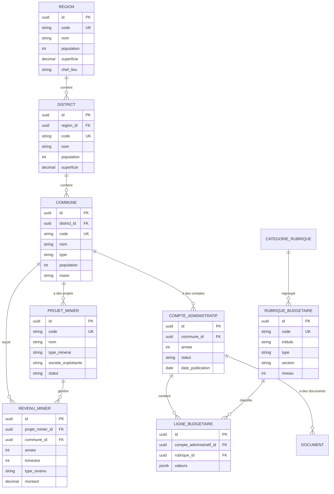
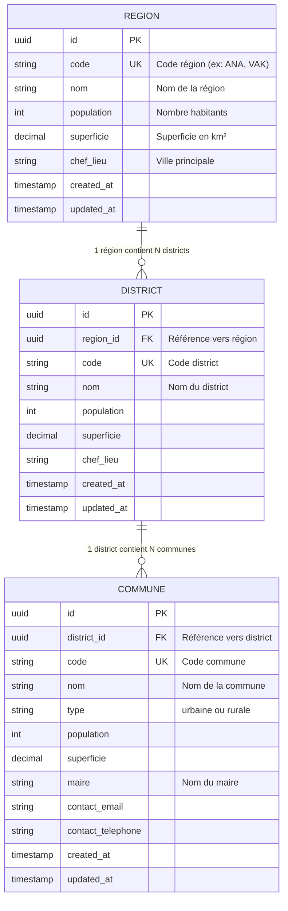
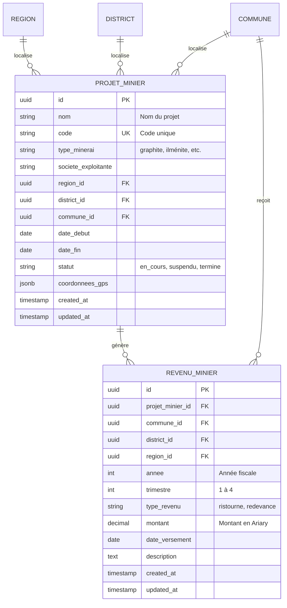
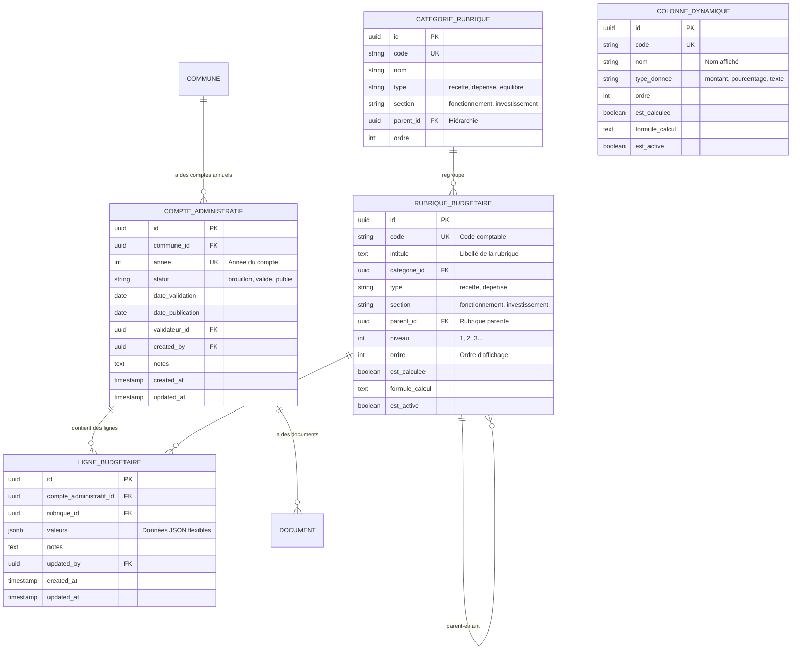
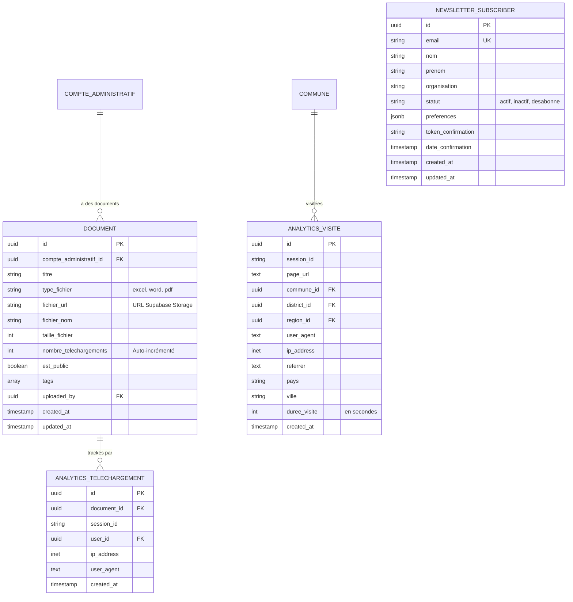
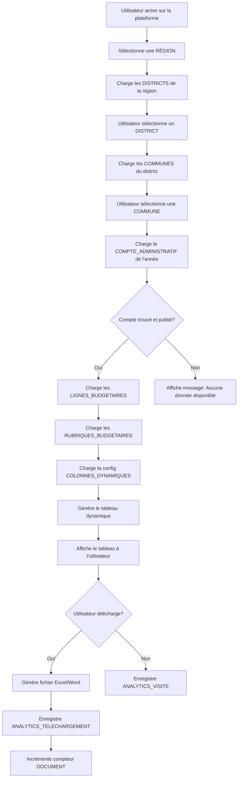
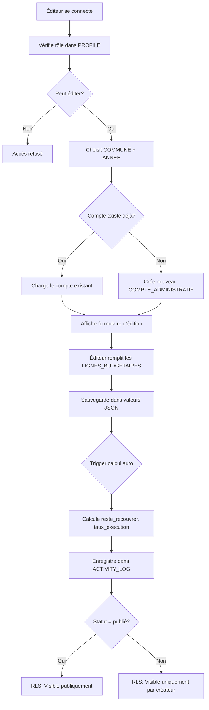

# Diagramme Entité-Relation (ERD)

Ce fichier contient les diagrammes ERD du modèle de données au format Mermaid.

## Diagramme Complet Simplifié



## Diagramme: Hiérarchie Géographique



## Diagramme: Projets Miniers et Revenus



## Diagramme: Comptes Administratifs



## Diagramme: Gestion des Utilisateurs

```mermaid
erDiagram
    AUTH_USERS ||--|| PROFILE : "a un profil"
    PROFILE ||--o{ ACTIVITY_LOG : "effectue des actions"
    PROFILE ||--o{ MESSAGE_SECURISE : "envoie/reçoit"

    AUTH_USERS {
        uuid id PK "Géré par Supabase Auth"
        string email UK
        timestamp created_at
    }

    PROFILE {
        uuid id PK-FK "Même ID que auth.users"
        string email UK
        string nom
        string prenom
        string role "administrateur, editeur, lecteur"
        string organisation
        string telephone
        string avatar_url
        jsonb permissions
        boolean est_actif
        timestamp derniere_connexion
        timestamp created_at
        timestamp updated_at
    }

    ACTIVITY_LOG {
        uuid id PK
        uuid user_id FK
        string action "create, update, delete"
        string table_name
        uuid record_id
        jsonb old_values
        jsonb new_values
        inet ip_address
        timestamp created_at
    }

    MESSAGE_SECURISE {
        uuid id PK
        uuid expediteur_id FK
        uuid destinataire_id FK
        string sujet
        text contenu
        boolean est_chiffre
        boolean est_lu
        date date_lecture
        jsonb fichiers_joints
        timestamp expiration_date
        timestamp created_at
    }
```

## Diagramme: Documents et Analytics



## Flux de Données: Consultation d'un Compte



## Flux de Données: Création d'un Compte



---

## Légende

### Types de Relations
- `||--o{` : Un à plusieurs (1:N)
- `||--||` : Un à un (1:1)
- `o{--o{` : Plusieurs à plusieurs (N:M)

### Contraintes
- `PK` : Primary Key (Clé primaire)
- `FK` : Foreign Key (Clé étrangère)
- `UK` : Unique Key (Contrainte d'unicité)

### Types de Données
- `uuid` : Identifiant universel unique
- `string` : Chaîne de caractères
- `text` : Texte long
- `int` : Nombre entier
- `decimal` : Nombre décimal
- `boolean` : Vrai/Faux
- `date` : Date
- `timestamp` : Date et heure
- `jsonb` : JSON binaire (PostgreSQL)
- `inet` : Adresse IP
- `array` : Tableau

---

## Visualisation en ligne

Pour visualiser ces diagrammes :

1. **Copier le code Mermaid**
2. **Coller dans un éditeur Mermaid en ligne** :
   - [Mermaid Live Editor](https://mermaid.live)
   - [GitHub](https://github.com) (supporte Mermaid nativement dans les README.md)
   - [VS Code](https://marketplace.visualstudio.com/items?itemName=bierner.markdown-mermaid) avec extension Markdown Preview Mermaid Support

3. **Exporter en image** :
   - PNG, SVG, ou PDF pour documentation

---

## Notes Techniques

### Performances
- Tous les `id` sont indexés automatiquement (PK)
- Les `FK` ont des index pour optimiser les jointures
- Les colonnes JSON (`valeurs`, `preferences`) ont des index GIN
- Les champs `nom` et `intitule` ont des index trigram pour la recherche full-text

### Sécurité
- Row Level Security (RLS) activé sur toutes les tables
- Les politiques RLS contrôlent l'accès selon le rôle utilisateur
- Les données sensibles sont protégées (ex: service_role_key)
- Audit trail complet via `activity_logs`

### Scalabilité
- Design normalisé pour éviter la redondance
- Vues matérialisées possibles pour les agrégations
- Partitionnement de tables possible (par année)
- Support natif PostgreSQL pour millions de lignes
